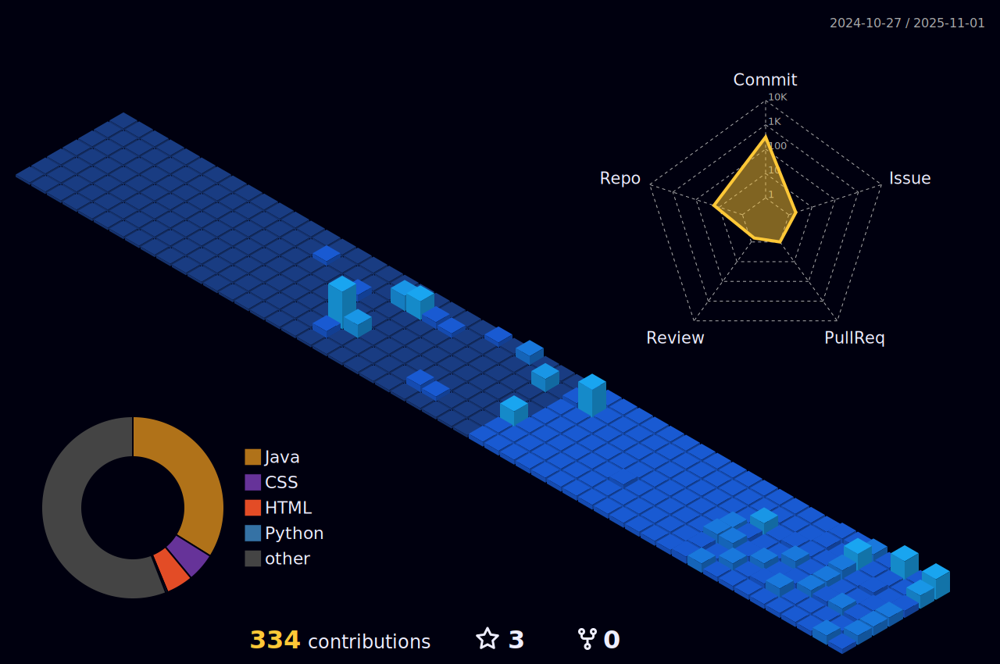

#   ```      Bernardo Freitas      ```  
   *Sou estudante do curso técnico de Desenvolvimento de Sistemas no SENAI e estou me dedicando ao estudo da linguagem Java, com o objetivo de me tornar um profissional na área de desenvolvimento de software.
Este repositório é um espaço para compartilhar meus projetos, acompanhar minha evolução e me conectar com outros desenvolvedores.*
<div align="left">
  <a href="https://www.linkedin.com/in/bernardo-freitas-3216152a6/" target="_blank">
    
  </a>
  <a href="mailto:bernardinho.freitas11@gmail.com" target="_blank">
    
  </a>
</div>

###  🔸```Tecnologias```:notebook_with_decorative_cover:
| 🔸 **HTML**  | :small_orange_diamond: **CSS**  | 🔸 **JavaScript**  |  🔸 **Java**   |
|:----- |:----- |:----- | :------ |

### 🔸```Estatísticas```:bar_chart:

  

<div style="display: flex; justify-content: space-between; width: 100%; align-items:center;">
  
  
  
</div>
